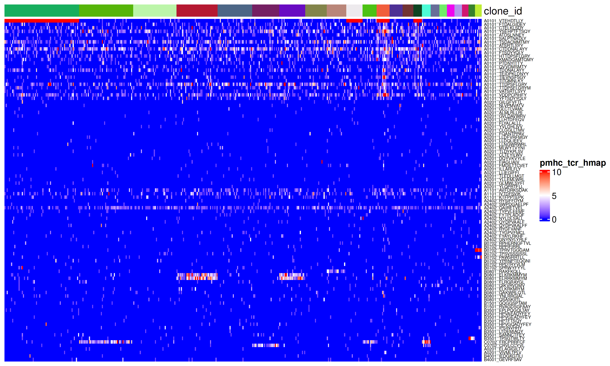
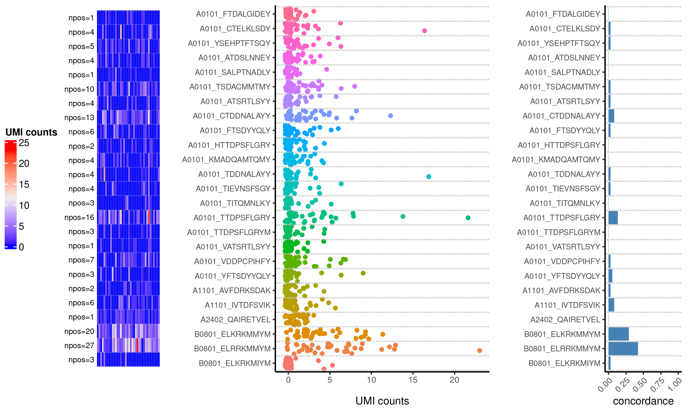
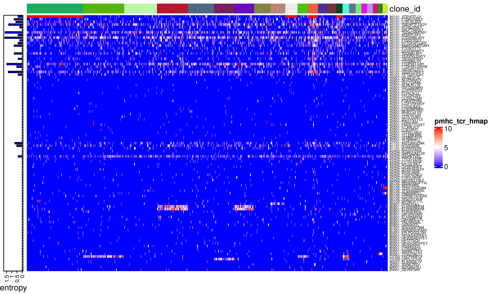
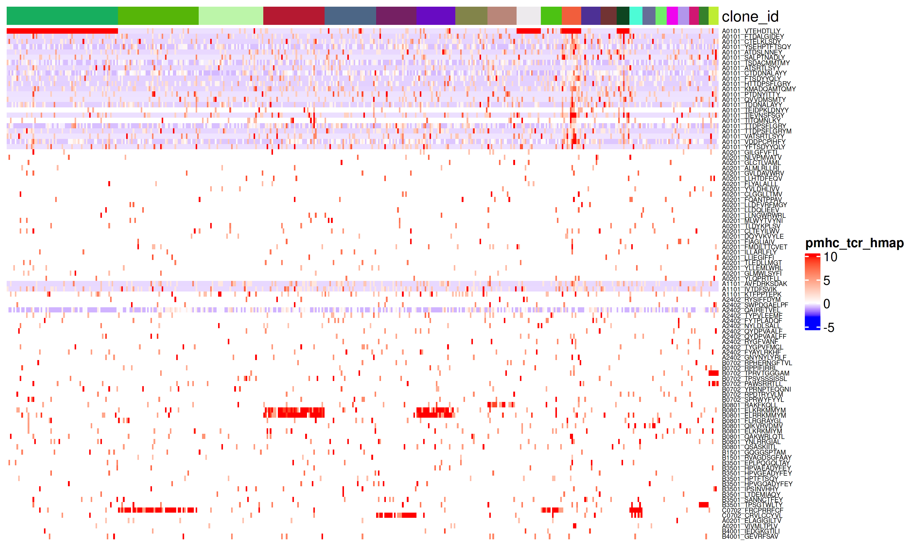
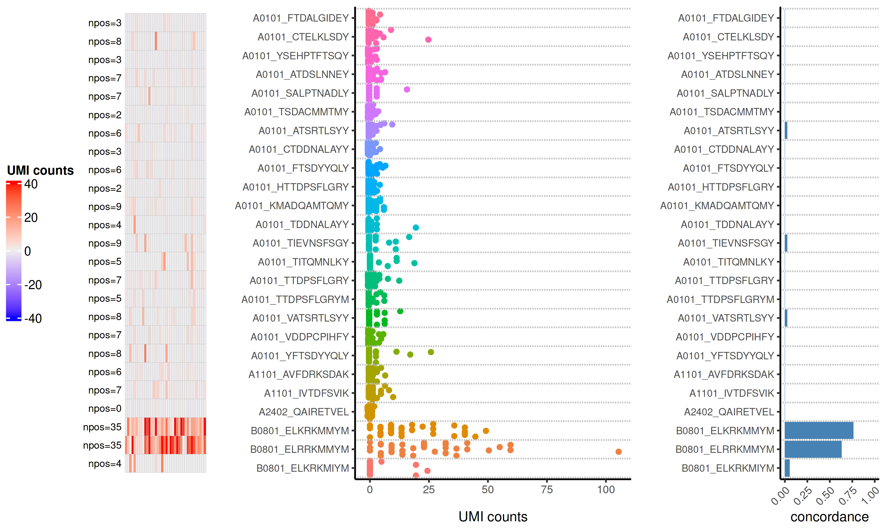
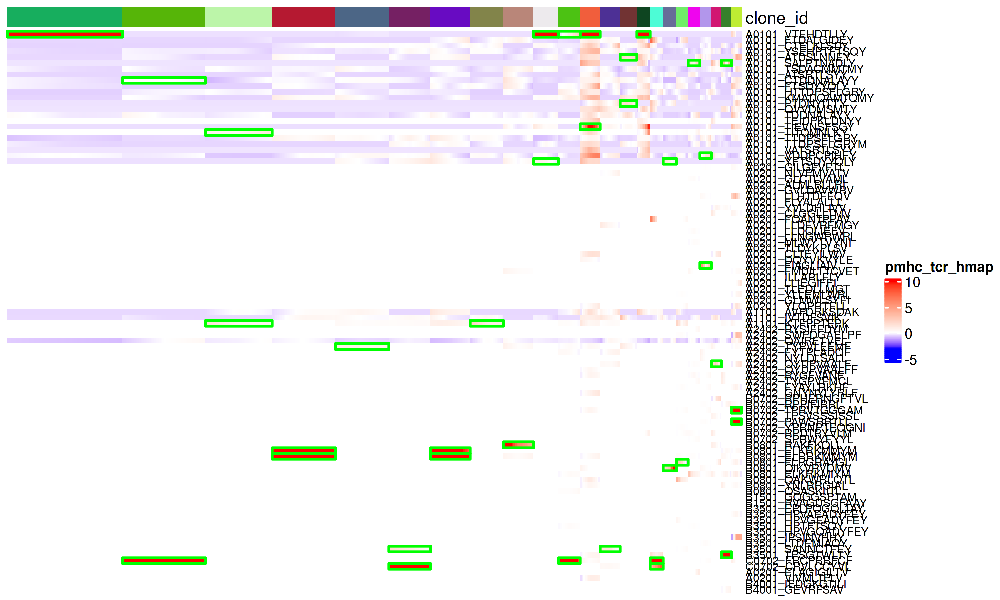
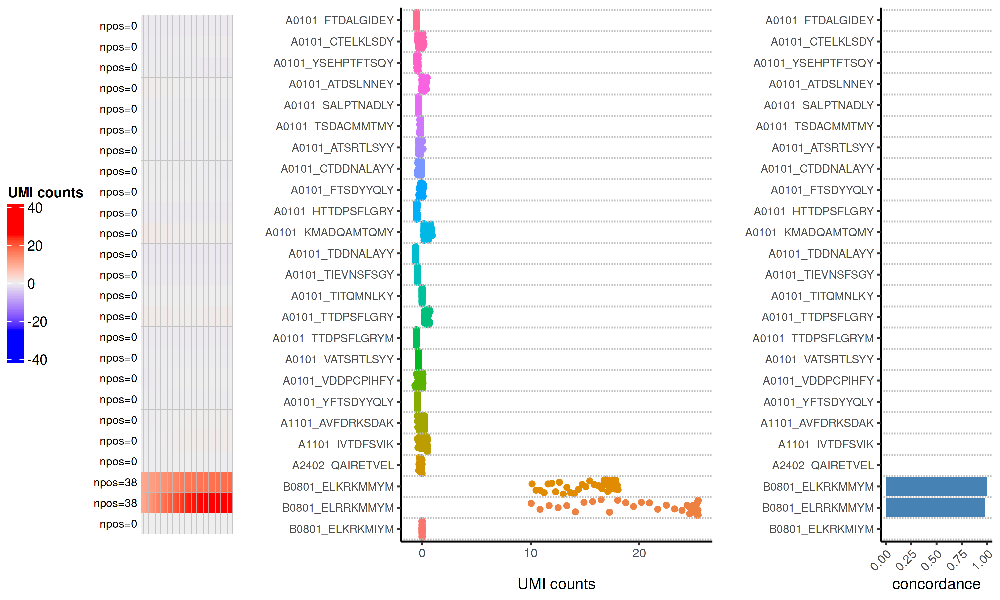
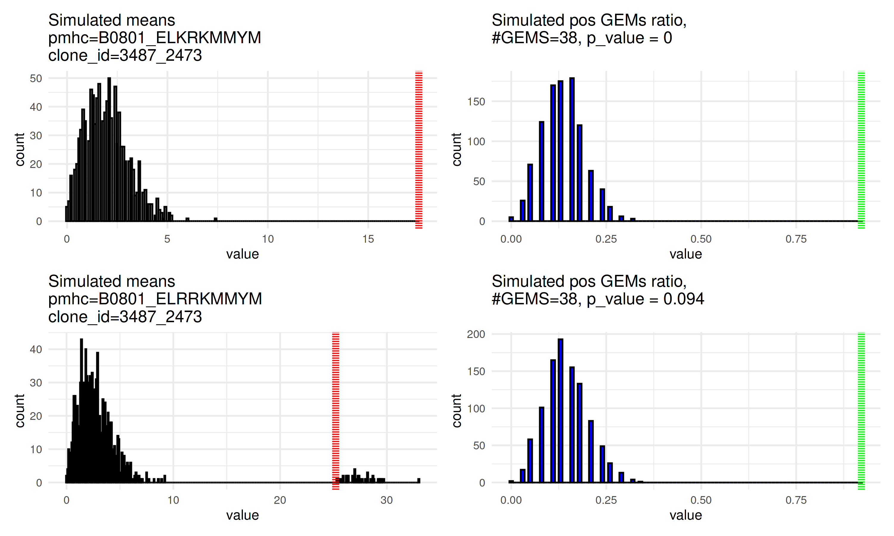

ITRAP2 vignette
================
Grigorii Nos
2025-07-15

- [R Markdown](#r-markdown)
- [visualise raw data](#visualise-raw-data)
  - [scaling](#scaling)
  - [smoothing](#smoothing)
  - [pMHC-TCR pairing confidence](#pmhc-tcr-pairing-confidence)

## R Markdown

ITRAP2 is a data denoising workflow for single-cell pMHC datasets. The
workflow also assigns the pMHC specificities to individual clonotypes.
ITRAP2 works with coupled single-cell pMHC counts with TCR clonotypes.

### load libraries

``` r
library(Seurat)
library(ITRAP2)
library(uniformly)
library(tidyverse)
library(ggplot2)
library(ComplexHeatmap)
```

### load the data

we generated a dataset with PBMC T cells from healthy donors, that were
screen for the recognition 100 pMHC panel of common chronic viral
epitopes, the data is stored as a Seurat object, as the whole package is
build around Seurat class

``` r
data('viral_screen')

viral_screen@assays$pMHC@counts[,1:5] %>% head()
```

    ## 6 x 5 sparse Matrix of class "dgCMatrix"
    ##          1OS_AAACCTGAGCCAGTTT 1OS_AAACCTGAGGCGCTCT 1OS_AAACCTGAGTCCTCCT 1OS_AAACCTGAGTGGTAAT 1OS_AAACCTGCACCCATTC
    ## sc-1OS-1                    .                    .                    .                    .                    .
    ## sc-1OS-2                    .                    .                    .                    1                    .
    ## sc-1OS-3                    .                    .                   12                    .                    1
    ## sc-1OS-4                    6                    .                    .                    2                    4
    ## sc-1OS-5                    .                    .                    1                    .                    .
    ## sc-1OS-6                    .                    .                    .                    .                    .

the gene expression part of this object is deleted here to save the
space, in case you want to explore the data with gene expression, you
are welcome to download it from ArrayExpress repository.
<https://www.ebi.ac.uk/biostudies/arrayexpress/studies/E-MTAB-13758?key=686eea8a-f64c-4c66-a859-9ca937cfa767>

you can see that features aren’t directly names as pMHC, sinse in some
experients the same barcode can by applied to different pMHC in
different donors, so we store this data.frame for pMHC annotation

``` r
viral_screen@misc$pmhc %>% head()       
```

    ## # A tibble: 6 × 5
    ##   Barcode  Sequence    HLA   `pep#` pmhc             
    ##   <chr>    <chr>       <chr> <chr>  <chr>            
    ## 1 sc-1OS-1 VTEHDTLLY   A0101 1      A0101_VTEHDTLLY  
    ## 2 sc-1OS-2 FTDALGIDEY  A0101 14     A0101_FTDALGIDEY 
    ## 3 sc-1OS-3 CTELKLSDY   A0101 3      A0101_CTELKLSDY  
    ## 4 sc-1OS-4 YSEHPTFTSQY A0101 2      A0101_YSEHPTFTSQY
    ## 5 sc-1OS-5 ATDSLNNEY   A0101 13     A0101_ATDSLNNEY  
    ## 6 sc-1OS-6 SALPTNADLY  A0101 15     A0101_SALPTNADLY

it will help to assign specificities in the @meta.data later on.

We also expect you to store your clonotype information for each gem in
@meta.data, we use `clone_id` column name, sinse we used immcantation
pipeline <https://immcantation.readthedocs.io/en/stable/> to process TCR
sequencing data.

``` r
viral_screen@meta.data$clone_id %>% head(10)
```

    ##  [1] NA          "333_277"   NA          NA          "351_1135"  "3546_1356" NA          "1309_1085" "1843_1712" "536_916"

# visualise raw data

Lets first look at the pMHC distribution of the raw pMHC count within
big clviral_screen, we expect a consistent signal for a specific pMHC
within some clviral_screen, before labeling the clone with the
specificity, but we also expect a substantial amount of noise.

``` r
# we subset gems from 1 donor for simplicity, bc=buffy coat, BC390 is a donor ID
obj_sub <- subset(viral_screen, BC == 'BC390') 

# we take obly 5+ gems clviral_screen  
clones <- obj_sub$clone_id[obj_sub$clone_size > 5] %>% table() %>% sort(decreasing = T) %>% names()

# and we plot the heatmap, sorted by clonotypes
pmhc_heatmap(object = obj_sub, slot = 'counts', hm_breaks = c(0, 5, 10), 
             rowm.fonts = 5, split_cols = T,
             clones=clones, show_row_names = T, clean_mat = F)
```


we can see that some clone (grouped columns) have noisy, but visible
consistent signals some pMHCs, we can further visualise a single clone
in more details

``` r
pmhc_dist_per_clone(object = viral_screen, clone = '3487_2473', aggr_threshold = 10, slot = 'counts')
```


Look at this clone and pMHC counts distributions, on the left we can see
that two B0801 pMHC have the highest number of gems, that aren’t zero.
We can as well calculate a metric called clonal pmhc concordance,
introduced in Polvsen et al 2023, elife, that calculates a proportion of
gems in the clone, whose highest value of pMHC count is in this pMHC. So
we can reasonably assume that this clone is B0801 specific, but data
isnot clean enough to have any automate way of assigning it.

Next we want to estimate the level of noisyness of each pMHC, we can do
that by calculating an entropy (
<https://en.wikipedia.org/wiki/Entropy_(information_theory)> ) for each
pMHC, the pMHCs with highest entropy are expected to be the noisiest

``` r
viral_screen <- score_pmhc_noise(viral_screen, how = 'per_clone', downsample_rate = .1, verbose=F)

hm_noise <- pmhc_heatmap(object = obj_sub, slot = 'counts', hm_breaks = c(0, 5, 10), 
                         rowm.fonts = 5, split_cols = F,
                         clones=clones, show_row_names = T, clean_mat = F)

left_ann_entropy <- rowAnnotation(
  entropy = anno_barplot(viral_screen@misc$noise_score$entropy,
                         width = unit(1, "cm"), 
                         gp = gpar(fill = "blue"),
                         axis_param = list(direction = "reverse")))

left_ann_entropy + hm_noise
```



You can see that the pMHCs with the highest entropy level procude the
most noise, we will use that metric to calculate confidence scores for
each pMHC-TCR pairs, where higher entropy lowers our confidence.

## scaling

So in next steps we can start to normalize and denoise the data, we
apply specific way of mean centering and sd scaling, where means and sds
are calculated, not taking outlines (\|z\|\>3) into account. this
approach is used, instead of typically used median centering and mad
scaling, since in sparse single-cell datasets, medians and mads are
often zeros.

We prefer to perform scaling on the whole dataset for better mean and sd
estimation.

``` r
viral_screen <- ScaleDataNoOutliers(viral_screen, verbose = F) # records scaled matrix into @assays$pMHC@data

obj_sub <- subset(viral_screen, BC == 'BC390') 

pmhc_heatmap(object = obj_sub, slot = 'data', hm_breaks = c(-3, 0, 10),
             split_cols = T, rowm.fonts = 5, clones = clones, 
             show_row_names = T, clean_mat = F)
```



Explore a single clone within scaled UMI counts space

``` r
pmhc_dist_per_clone(object = obj_sub, clone = '3487_2473', aggr_threshold = 10, slot = 'data')
```



We can clearly see more clear signal, that we can further improve in the
next step, which is smoothing each pMHC within each expanded clone,
using local regression (loess).

## smoothing

``` r
obj_sub <- smooth_pmhc(object = obj_sub, assay = 'pMHC', 
                       cap_upper_quantiles = T, # clip huge outliers, turning them into the replacement quantile, default=T
                       replacement_q = .85, # which quantile to use for the clipping
                       replace_ones = T  # replace 1 UMI count with zero pre-smoothing
                       )
```

    ##   |                                                          |                                                  |   0%
    ## smoothing each pMHC within each clone bigger than 3 
    ##   |                                                          |+                                                 |   3%  |                                                          |+++                                               |   5%  |                                                          |++++                                              |   8%  |                                                          |+++++                                             |  11%  |                                                          |+++++++                                           |  14%  |                                                          |++++++++                                          |  16%  |                                                          |+++++++++                                         |  19%  |                                                          |+++++++++++                                       |  22%  |                                                          |++++++++++++                                      |  24%  |                                                          |++++++++++++++                                    |  27%  |                                                          |+++++++++++++++                                   |  30%  |                                                          |++++++++++++++++                                  |  32%  |                                                          |++++++++++++++++++                                |  35%  |                                                          |+++++++++++++++++++                               |  38%  |                                                          |++++++++++++++++++++                              |  41%  |                                                          |++++++++++++++++++++++                            |  43%  |                                                          |+++++++++++++++++++++++                           |  46%  |                                                          |++++++++++++++++++++++++                          |  49%  |                                                          |++++++++++++++++++++++++++                        |  51%  |                                                          |+++++++++++++++++++++++++++                       |  54%  |                                                          |++++++++++++++++++++++++++++                      |  57%  |                                                          |++++++++++++++++++++++++++++++                    |  59%  |                                                          |+++++++++++++++++++++++++++++++                   |  62%  |                                                          |++++++++++++++++++++++++++++++++                  |  65%  |                                                          |++++++++++++++++++++++++++++++++++                |  68%  |                                                          |+++++++++++++++++++++++++++++++++++               |  70%  |                                                          |++++++++++++++++++++++++++++++++++++              |  73%  |                                                          |++++++++++++++++++++++++++++++++++++++            |  76%  |                                                          |+++++++++++++++++++++++++++++++++++++++           |  78%  |                                                          |+++++++++++++++++++++++++++++++++++++++++         |  81%  |                                                          |++++++++++++++++++++++++++++++++++++++++++        |  84%  |                                                          |+++++++++++++++++++++++++++++++++++++++++++       |  86%  |                                                          |+++++++++++++++++++++++++++++++++++++++++++++     |  89%  |                                                          |++++++++++++++++++++++++++++++++++++++++++++++    |  92%  |                                                          |+++++++++++++++++++++++++++++++++++++++++++++++   |  95%  |                                                          |+++++++++++++++++++++++++++++++++++++++++++++++++ |  97%

and next we can start pairing TCRs with pMHCs, not for a small clone \<3
gems we will not take into account pMHC with entropy higher than 0.7.
This function will also calculate confidence score for each pMHC pair.
Green frames highlight the assigned specificities

``` r
obj_sub <- assign_pmhc(object = obj_sub, assay = 'pMHC', slot = 'scale.data', 
                       assignment = 'rosner', # use extreme alternatively
                       rosner_alpha=.001, # from which alpha to assign the pMHC 
                       assign_small_clones = T)
```

    ## 
    ## Aggregating clonotype aggregated pseudobulk pMHC matrix

    ## 
    ## Removing features with entropy smaller than 1 for clones > than 3 gems
    ##   |                                                          |                                                  |   0%
    ## assigning pMHC-TCR pairs

    ##   |                                                          |                                                  |   1%

    ##   |                                                          |+                                                 |   1%

    ##   |                                                          |+                                                 |   2%

    ##   |                                                          |+                                                 |   3%

    ##   |                                                          |++                                                |   3%

    ##   |                                                          |++                                                |   4%

    ##   |                                                          |++                                                |   5%

    ##   |                                                          |+++                                               |   5%

    ##   |                                                          |+++                                               |   6%

    ##   |                                                          |+++                                               |   7%

    ##   |                                                          |++++                                              |   7%

    ##   |                                                          |++++                                              |   8%

    ##   |                                                          |++++                                              |   9%

    ##   |                                                          |+++++                                             |  10%

    ##   |                                                          |+++++                                             |  11%

    ##   |                                                          |++++++                                            |  11%

    ##   |                                                          |++++++                                            |  12%

    ##   |                                                          |++++++                                            |  13%

    ##   |                                                          |+++++++                                           |  13%

    ##   |                                                          |+++++++                                           |  14%

    ##   |                                                          |+++++++                                           |  15%

    ##   |                                                          |++++++++                                          |  15%

    ##   |                                                          |++++++++                                          |  16%

    ##   |                                                          |++++++++                                          |  17%

    ##   |                                                          |+++++++++                                         |  17%

    ##   |                                                          |+++++++++                                         |  18%

    ##   |                                                          |+++++++++                                         |  19%

    ##   |                                                          |++++++++++                                        |  19%

    ##   |                                                          |++++++++++                                        |  20%

    ##   |                                                          |+++++++++++                                       |  21%

    ##   |                                                          |+++++++++++                                       |  22%

    ##   |                                                          |+++++++++++                                       |  23%

    ##   |                                                          |++++++++++++                                      |  23%

    ##   |                                                          |++++++++++++                                      |  24%

    ##   |                                                          |++++++++++++                                      |  25%

    ##   |                                                          |+++++++++++++                                     |  26%

    ##   |                                                          |+++++++++++++                                     |  27%

    ##   |                                                          |++++++++++++++                                    |  27%

    ##   |                                                          |++++++++++++++                                    |  28%

    ##   |                                                          |++++++++++++++                                    |  29%

    ##   |                                                          |+++++++++++++++                                   |  30%

    ##   |                                                          |+++++++++++++++                                   |  31%

    ##   |                                                          |++++++++++++++++                                  |  31%

    ##   |                                                          |++++++++++++++++                                  |  32%

    ##   |                                                          |++++++++++++++++                                  |  33%

    ##   |                                                          |+++++++++++++++++                                 |  33%

    ##   |                                                          |+++++++++++++++++                                 |  34%

    ##   |                                                          |+++++++++++++++++                                 |  35%

    ##   |                                                          |++++++++++++++++++                                |  35%

    ##   |                                                          |++++++++++++++++++                                |  36%

    ##   |                                                          |++++++++++++++++++                                |  37%

    ##   |                                                          |+++++++++++++++++++                               |  37%

    ##   |                                                          |+++++++++++++++++++                               |  38%

    ##   |                                                          |+++++++++++++++++++                               |  39%

    ##   |                                                          |++++++++++++++++++++                              |  39%

    ##   |                                                          |++++++++++++++++++++                              |  40%

    ##   |                                                          |++++++++++++++++++++                              |  41%

    ##   |                                                          |+++++++++++++++++++++                             |  41%

    ##   |                                                          |+++++++++++++++++++++                             |  43%

    ##   |                                                          |++++++++++++++++++++++                            |  43%

    ##   |                                                          |++++++++++++++++++++++                            |  44%

    ##   |                                                          |+++++++++++++++++++++++                           |  45%

    ##   |                                                          |+++++++++++++++++++++++                           |  46%

    ##   |                                                          |+++++++++++++++++++++++                           |  47%

    ##   |                                                          |++++++++++++++++++++++++                          |  47%

    ##   |                                                          |++++++++++++++++++++++++                          |  48%

    ##   |                                                          |++++++++++++++++++++++++                          |  49%

    ##   |                                                          |+++++++++++++++++++++++++                         |  50%

    ##   |                                                          |+++++++++++++++++++++++++                         |  51%

    ##   |                                                          |++++++++++++++++++++++++++                        |  51%

    ##   |                                                          |++++++++++++++++++++++++++                        |  52%

    ##   |                                                          |+++++++++++++++++++++++++++                       |  54%

    ##   |                                                          |+++++++++++++++++++++++++++                       |  55%

    ##   |                                                          |++++++++++++++++++++++++++++                      |  56%

    ##   |                                                          |++++++++++++++++++++++++++++                      |  57%

    ##   |                                                          |+++++++++++++++++++++++++++++                     |  58%

    ##   |                                                          |+++++++++++++++++++++++++++++                     |  59%

    ##   |                                                          |++++++++++++++++++++++++++++++                    |  59%

    ##   |                                                          |++++++++++++++++++++++++++++++                    |  60%

    ##   |                                                          |++++++++++++++++++++++++++++++                    |  61%

    ##   |                                                          |+++++++++++++++++++++++++++++++                   |  61%

    ##   |                                                          |+++++++++++++++++++++++++++++++                   |  62%

    ##   |                                                          |+++++++++++++++++++++++++++++++                   |  63%

    ##   |                                                          |++++++++++++++++++++++++++++++++                  |  63%

    ##   |                                                          |++++++++++++++++++++++++++++++++                  |  64%

    ##   |                                                          |++++++++++++++++++++++++++++++++                  |  65%

    ##   |                                                          |+++++++++++++++++++++++++++++++++                 |  65%

    ##   |                                                          |+++++++++++++++++++++++++++++++++                 |  66%

    ##   |                                                          |+++++++++++++++++++++++++++++++++                 |  67%

    ##   |                                                          |++++++++++++++++++++++++++++++++++                |  67%

    ##   |                                                          |++++++++++++++++++++++++++++++++++                |  68%

    ##   |                                                          |++++++++++++++++++++++++++++++++++                |  69%

    ##   |                                                          |+++++++++++++++++++++++++++++++++++               |  69%

    ##   |                                                          |+++++++++++++++++++++++++++++++++++               |  70%

    ##   |                                                          |+++++++++++++++++++++++++++++++++++               |  71%

    ##   |                                                          |++++++++++++++++++++++++++++++++++++              |  71%

    ##   |                                                          |++++++++++++++++++++++++++++++++++++              |  72%

    ##   |                                                          |++++++++++++++++++++++++++++++++++++              |  73%

    ##   |                                                          |+++++++++++++++++++++++++++++++++++++             |  73%

    ##   |                                                          |+++++++++++++++++++++++++++++++++++++             |  74%

    ##   |                                                          |++++++++++++++++++++++++++++++++++++++            |  75%

    ##   |                                                          |++++++++++++++++++++++++++++++++++++++            |  76%

    ##   |                                                          |++++++++++++++++++++++++++++++++++++++            |  77%

    ##   |                                                          |+++++++++++++++++++++++++++++++++++++++           |  77%

    ##   |                                                          |+++++++++++++++++++++++++++++++++++++++           |  78%

    ##   |                                                          |+++++++++++++++++++++++++++++++++++++++           |  79%

    ##   |                                                          |++++++++++++++++++++++++++++++++++++++++          |  79%

    ##   |                                                          |++++++++++++++++++++++++++++++++++++++++          |  80%

    ##   |                                                          |++++++++++++++++++++++++++++++++++++++++          |  81%

    ##   |                                                          |+++++++++++++++++++++++++++++++++++++++++         |  81%

    ##   |                                                          |+++++++++++++++++++++++++++++++++++++++++         |  82%

    ##   |                                                          |+++++++++++++++++++++++++++++++++++++++++         |  83%

    ##   |                                                          |++++++++++++++++++++++++++++++++++++++++++        |  83%

    ##   |                                                          |++++++++++++++++++++++++++++++++++++++++++        |  84%

    ##   |                                                          |++++++++++++++++++++++++++++++++++++++++++        |  85%

    ##   |                                                          |+++++++++++++++++++++++++++++++++++++++++++       |  85%

    ##   |                                                          |+++++++++++++++++++++++++++++++++++++++++++       |  86%

    ##   |                                                          |+++++++++++++++++++++++++++++++++++++++++++       |  87%

    ##   |                                                          |++++++++++++++++++++++++++++++++++++++++++++      |  87%

    ##   |                                                          |++++++++++++++++++++++++++++++++++++++++++++      |  88%

    ##   |                                                          |++++++++++++++++++++++++++++++++++++++++++++      |  89%

    ##   |                                                          |+++++++++++++++++++++++++++++++++++++++++++++     |  89%

    ##   |                                                          |+++++++++++++++++++++++++++++++++++++++++++++     |  90%

    ##   |                                                          |+++++++++++++++++++++++++++++++++++++++++++++     |  91%

    ##   |                                                          |++++++++++++++++++++++++++++++++++++++++++++++    |  91%

    ##   |                                                          |++++++++++++++++++++++++++++++++++++++++++++++    |  92%

    ##   |                                                          |++++++++++++++++++++++++++++++++++++++++++++++    |  93%

    ##   |                                                          |+++++++++++++++++++++++++++++++++++++++++++++++   |  93%

    ##   |                                                          |+++++++++++++++++++++++++++++++++++++++++++++++   |  94%

    ##   |                                                          |+++++++++++++++++++++++++++++++++++++++++++++++   |  95%

    ##   |                                                          |++++++++++++++++++++++++++++++++++++++++++++++++  |  95%

    ##   |                                                          |++++++++++++++++++++++++++++++++++++++++++++++++  |  96%

    ##   |                                                          |++++++++++++++++++++++++++++++++++++++++++++++++  |  97%

    ##   |                                                          |+++++++++++++++++++++++++++++++++++++++++++++++++ |  97%

    ##   |                                                          |+++++++++++++++++++++++++++++++++++++++++++++++++ |  98%

    ##   |                                                          |+++++++++++++++++++++++++++++++++++++++++++++++++ |  99%

    ##   |                                                          |++++++++++++++++++++++++++++++++++++++++++++++++++|  99%

    ##   |                                                          |++++++++++++++++++++++++++++++++++++++++++++++++++| 100%

    ## 
    ## 
    ## merging TCR-pMHC information into objects @meta.data

We recommend adjusting this parameters for assign_pmhc, checking how
your assignment look on the pMHC heatmap, in some datasets certain
parameters fail, which you can only see from visualizing your
assignments. For more cross-reactivity heavy datasets, try using
extreme, instead of rosner assignments. If you feel like a lot of
potential specificities are missed, try to change alpha in assign_pmhc.

``` r
pmhc_heatmap(object = obj_sub, slot = 'scale.data', hm_breaks = c(-3, 0, 10), highlight_pmhc.tcr = T,
             clones = clones, show_row_names = T, clean_mat = F, verbose= F )
```



``` r
pmhc_dist_per_clone(object = obj_sub, clone = '3487_2473', aggr_threshold = 10, slot = 'scale.data')
```



## pMHC-TCR pairing confidence

Each TCR-pMHC interaction recieves a confidence score and p value.
Confidence score is calculated as a sum of pmhc’s clonotype concordance,
log of clone size, subtracted by the noisyness of pMHC.

$$
\mathbf{Confidence} = \alpha \cdot C + \beta \cdot \log(S + 1) - \gamma \cdot E
$$

### Permutation Test Procedure

The p-value is obtained by performing two separate permutation tests for
the $pMHC$ value and its stability. These p-values are then combined
using Fisher’s method.

For the $pMHC$ value permutation test, we simulate $n$ subsamples of the
same size as the clonotype. We compare the observed $pMHC$ value
(denoted as $V_{obs}$) within the clone to the distribution of values
obtained from simulated clones consisting of random cells.

$$
\text{p-value}_{V} = \frac{1}{n} \sum_{i=1}^{n} \mathbf{1}(V_{sim,i} \geq V_{obs})
$$

For the stability permutation test, we compare the observed stability
(denoted as $S_{obs}$) within the clone to the distribution of stability
values obtained from simulated clones.

$$
\text{p-value}_{S} = \frac{1}{n} \sum_{i=1}^{n} \mathbf{1}(S_{sim,i} \geq S_{obs})
$$

``` r
p_value <- plot_tcr_pmhc_permutation(object = obj_sub, clone = '3487_2473', assay = 'pMHC', slot = 'data')
p_value
```



this way loess regression minimises the within clone variability in the
pMHC values, forcing outliers to follow the trend, thus denoising the
data and making it easy to autocratically assign specificities to each
clone. If clone has no signal for any pMHc in your panel, its labeled as
negative. The pMHC assignments are stored in `pMHC_classification`
column by default

``` r
obj_sub@meta.data %>%
  select(pMHC_classification, pMHC_confidence, pMHC_pvalues) %>% 
  head(10)
```

    ##                                   pMHC_classification pMHC_confidence pMHC_pvalues
    ## 1OS_AAACCTGGTAGCCTAT A0101_TIEVNSFSGY:A0101_VTEHDTLLY       2.21:4.09          0:0
    ## 1OS_AAACCTGGTATTCTCT  B0801_ELKRKMMYM:B0801_ELRRKMMYM       4.45:4.76      0:0.065
    ## 1OS_AAAGCAAAGGTGCAAC                  B0801_ELRRKMMYM            2.42         0.17
    ## 1OS_AAAGCAACATTGGTAC                  A0101_VTEHDTLLY            5.84            0
    ## 1OS_AAAGTAGAGTCGATAA                  A2402_TYPVLEEMF            4.44        0.142
    ## 1OS_AAATGCCGTGCAACGA                         Negative        Negative     Negative
    ## 1OS_AAATGCCTCAGTTGAC A0101_YFTSDYYQLY:B0801_QIKVRVDMV        1.9:3.33   0.49:0.005
    ## 1OS_AAATGCCTCCTATTCA  B3501_SANNCTFEY:C0702_CRVLCCYVL       3.37:4.82      0.018:0
    ## 1OS_AAATGCCTCTAAGCCA                  A2402_TYPVLEEMF            4.44        0.142
    ## 1OS_AACACGTCATGCCACG                             <NA>            <NA>         <NA>

    ## R version 4.3.1 (2023-06-16)
    ## Platform: x86_64-pc-linux-gnu (64-bit)
    ## Running under: Ubuntu 22.04.4 LTS
    ## 
    ## Matrix products: default
    ## BLAS:   /opt/R-4.3.1/lib/libRblas.so 
    ## LAPACK: /usr/lib/x86_64-linux-gnu/lapack/liblapack.so.3.10.0
    ## 
    ## locale:
    ##  [1] LC_CTYPE=en_US.UTF-8       LC_NUMERIC=C               LC_TIME=en_US.UTF-8        LC_COLLATE=en_US.UTF-8     LC_MONETARY=en_US.UTF-8   
    ##  [6] LC_MESSAGES=en_US.UTF-8    LC_PAPER=en_US.UTF-8       LC_NAME=C                  LC_ADDRESS=C               LC_TELEPHONE=C            
    ## [11] LC_MEASUREMENT=en_US.UTF-8 LC_IDENTIFICATION=C       
    ## 
    ## time zone: Europe/Copenhagen
    ## tzcode source: system (glibc)
    ## 
    ## attached base packages:
    ## [1] grid      stats     graphics  grDevices utils     datasets  methods   base     
    ## 
    ## other attached packages:
    ##  [1] patchwork_1.3.0       RColorBrewer_1.1-3    circlize_0.4.16       randomcoloR_1.1.0.1   ComplexHeatmap_2.18.0 lubridate_1.9.3      
    ##  [7] forcats_1.0.0         stringr_1.5.1         dplyr_1.1.3           purrr_1.0.2           readr_2.1.5           tidyr_1.3.1          
    ## [13] tibble_3.2.1          ggplot2_3.5.1         tidyverse_2.0.0       uniformly_0.5.0       SeuratObject_5.0.1    Seurat_4.4.0         
    ## [19] ITRAP2_0.1.0          EnvStats_3.0.0        shades_1.4.0         
    ## 
    ## loaded via a namespace (and not attached):
    ##   [1] RcppAnnoy_0.0.22       splines_4.3.1          later_1.3.2            polyclip_1.10-6        lifecycle_1.0.4        doParallel_1.0.17     
    ##   [7] rprojroot_2.0.4        globals_0.16.3         processx_3.8.6         lattice_0.22-6         MASS_7.3-60            magrittr_2.0.3        
    ##  [13] plotly_4.10.4          rmarkdown_2.29         distillery_1.2-2       yaml_2.3.10            remotes_2.5.0          httpuv_1.6.12         
    ##  [19] sctransform_0.4.1      spam_2.11-1            sp_2.1-1               sessioninfo_1.2.3      pkgbuild_1.4.6         spatstat.sparse_3.1-0 
    ##  [25] reticulate_1.34.0      cowplot_1.1.3          pbapply_1.7-2          abind_1.4-8            pkgload_1.4.0          Rtsne_0.17            
    ##  [31] BiocGenerics_0.48.1    rgl_1.3.17             IRanges_2.36.0         S4Vectors_0.40.2       ggrepel_0.9.4          irlba_2.3.5.1         
    ##  [37] listenv_0.9.1          spatstat.utils_3.1-5   goftest_1.2-3          spatstat.random_3.4-1  fitdistrplus_1.2-2     parallelly_1.42.0     
    ##  [43] commonmark_1.9.5       leiden_0.4.3.1         codetools_0.2-20       xml2_1.3.8             tidyselect_1.2.1       shape_1.4.6.1         
    ##  [49] ramify_0.3.3           farver_2.1.2           matrixStats_1.2.0      stats4_4.3.1           base64enc_0.1-3        spatstat.explore_3.5-2
    ##  [55] roxygen2_7.3.2         jsonlite_1.8.8         GetoptLong_1.0.5       ellipsis_0.3.2         progressr_0.15.1       ggridges_0.5.6        
    ##  [61] survival_3.5-8         iterators_1.0.14       foreach_1.5.2          tools_4.3.1            ica_1.0-3              Rcpp_1.0.12           
    ##  [67] glue_1.7.0             gridExtra_2.3          extRemes_2.2           xfun_0.51              usethis_3.1.0          withr_3.0.2           
    ##  [73] fastmap_1.2.0          callr_3.7.6            digest_0.6.34          timechange_0.3.0       R6_2.6.1               mime_0.13             
    ##  [79] colorspace_2.1-1       Cairo_1.6-2            scattermore_1.2        tensor_1.5             spatstat.data_3.1-8    utf8_1.2.4            
    ##  [85] generics_0.1.3         data.table_1.15.0      httr_1.4.7             htmlwidgets_1.6.2      whisker_0.4.1          uwot_0.2.3            
    ##  [91] pkgconfig_2.0.3        gtable_0.3.6           lmtest_0.9-40          htmltools_0.5.6.1      profvis_0.4.0          dotCall64_1.2         
    ##  [97] clue_0.3-66            scales_1.3.0           png_0.1-8              spatstat.univar_3.1-4  knitr_1.50             rstudioapi_0.17.1     
    ## [103] tzdb_0.5.0             reshape2_1.4.4         rjson_0.2.23           nlme_3.1-164           curl_6.2.1             cachem_1.1.0          
    ## [109] zoo_1.8-13             GlobalOptions_0.1.2    KernSmooth_2.23-26     parallel_4.3.1         miniUI_0.1.1.1         desc_1.4.3            
    ## [115] pillar_1.10.1          vctrs_0.6.4            RANN_2.6.2             urlchecker_1.0.1       promises_1.2.1         xtable_1.8-4          
    ## [121] cluster_2.1.8.1        evaluate_1.0.3         magick_2.8.5           cli_3.6.2              compiler_4.3.1         rlang_1.1.3           
    ## [127] crayon_1.5.3           future.apply_1.11.3    labeling_0.4.3         ps_1.9.0               plyr_1.8.9             fs_1.6.5              
    ## [133] stringi_1.8.3          viridisLite_0.4.2      deldir_2.0-2           munsell_0.5.1          Lmoments_1.3-1         lazyeval_0.2.2        
    ## [139] devtools_2.4.5         spatstat.geom_3.5-0    V8_6.0.2               Matrix_1.6-5           hms_1.1.3              future_1.34.0         
    ## [145] shiny_1.8.0            pgnorm_2.0             ROCR_1.0-11            igraph_2.0.1.1         memoise_2.0.1
